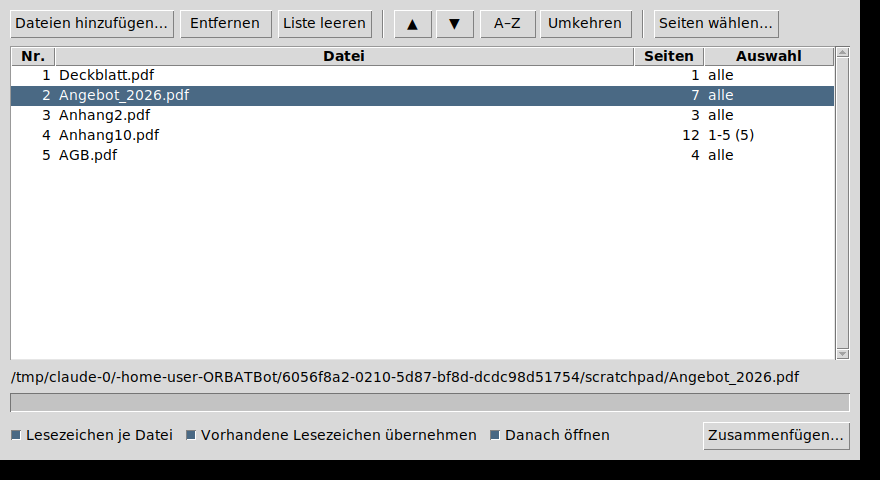

# PDF-Merger

Ein kleines Windows-Programm, um mehrere PDF-Dateien auszuwählen, die
Reihenfolge festzulegen und sie zu einer Datei zusammenzufügen.



*Aufnahme aus dem automatischen Test unter Linux — die Anordnung ist dieselbe,
unter Windows zeichnet Tk die Bedienelemente im System-Look.*

## Herunterladen

Fertige Dateien liegen unter
[**Releases**](https://github.com/loltorres9/PDF_App/releases) — Python wird auf
dem Zielrechner nicht gebraucht:

| Datei | Wofür |
|---|---|
| **`PDF-Merger-Setup.exe`** | **Empfohlen.** Installer: Startmenü-Eintrag, auf Wunsch Desktop-Symbol und ein Eintrag unter *Senden an*. Nur für den angemeldeten Benutzer, ohne Administratorrechte |
| `PDF-Merger.exe` | Das Programm als einzelne Datei, ganz ohne Installation |
| `SHA256SUMS.txt` | Prüfsummen der beiden Dateien aus demselben Build |

### Windows warnt — warum, und was zu tun ist

Beide Dateien sind **nicht signiert**: ein Code-Signing-Zertifikat kostet
mehrere hundert Euro im Jahr. Zusätzlich kennt SmartScreen jede frisch
veröffentlichte Datei erst einmal nicht. Die Warnungen sagen deshalb nichts
darüber aus, was in der Datei steckt — sie erscheinen bei jedem unsignierten
Programm.

1. **Beim Herunterladen** („wird nicht häufig heruntergeladen"):
   im Download-Menü *Beibehalten* → *Trotzdem beibehalten*.
2. **Beim ersten Start** („Der Computer wurde durch Windows geschützt"):
   *Weitere Informationen* → *Trotzdem ausführen*.
3. **Oder vorher entsperren:** Rechtsklick → *Eigenschaften* → *Zulassen*
   ankreuzen → *OK*. In PowerShell: `Unblock-File .\PDF-Merger-Setup.exe`.

Nachrechnen statt vertrauen — die Werte stehen in den Release-Notizen und in
`SHA256SUMS.txt`, erzeugt vom selben Build, der die Dateien gepackt hat:

```powershell
Get-FileHash .\PDF-Merger-Setup.exe -Algorithm SHA256
```

Wer die Warnung ganz loswerden will, kommt an einer Signatur nicht vorbei:
ein gekauftes Zertifikat (bei EV sofort wirksam, bei OV erst mit wachsender
Download-Reputation), [Azure Artifact Signing](https://azure.microsoft.com/en-us/products/artifact-signing)
für Organisationen, oder [SignPath Foundation](https://signpath.io/solutions/open-source-community),
das Open-Source-Projekte kostenlos signiert. Ein selbst erstelltes Zertifikat
hilft **nicht** — SmartScreen ignoriert es.

## Aus dem Quellcode starten

```bat
pip install -r requirements.txt
python pdfmerge.py
```

Oder per Doppelklick auf **`start.bat`** (installiert die Abhängigkeit beim
ersten Mal selbst und startet das Fenster ohne Konsole).

Dateien lassen sich auch direkt mitgeben — genau das nutzt der „Senden
an“-Eintrag:

```bat
python pdfmerge.py a.pdf b.pdf
```

## Selbst bauen

Doppelklick auf **`build.bat`**: baut `dist\PDF-Merger.exe` und, wenn
[Inno Setup](https://jrsoftware.org/isdl.php) installiert ist, zusätzlich
`installer_out\PDF-Merger-Setup.exe`. Der Build braucht einmalig Internet
(PyInstaller + pypdf).

Dasselbe macht der Workflow `.github/workflows/windows-build.yml` bei jedem
Push auf `main` auf einem Windows-Rechner von GitHub und hängt das Ergebnis an
ein Release. Die Version steht **nur** in `pdfmerge_core.__version__`; Exe-
Eigenschaften, Installer und Release-Tag lesen sie von dort.

## Bedienung

| | |
|---|---|
| **Dateien hinzufügen…** | Mehrfachauswahl im Dialog (Strg+O) |
| **Ziehen mit der Maus** | Zeile(n) in der Liste an die gewünschte Stelle ziehen |
| **▲ / ▼** | Auswahl eine Position nach oben/unten (Alt+Hoch / Alt+Runter) |
| **A–Z** | Nach Dateiname sortieren — natürlich, also `Anhang2` vor `Anhang10` |
| **Umkehren** | Reihenfolge umdrehen |
| **Seiten wählen…** | Nur einen Teil einer Datei übernehmen (Doppelklick auf die Zeile) |
| **Entfernen** | Auswahl aus der Liste (Entf-Taste) |
| **Zusammenfügen…** | Zielpfad wählen und speichern |

Die Reihenfolge in der Liste ist exakt die Reihenfolge im Ergebnis; die Spalte
**Nr.** zeigt sie an. Unten steht laufend, wie viele Seiten die Ergebnisdatei
bekommt.

### Seitenauswahl

Im Feld *Seiten wählen* gilt:

| Eingabe | Bedeutung |
|---|---|
| leer, `alle`, `*` | die ganze Datei |
| `1-3` | Seiten 1 bis 3 |
| `5-` | ab Seite 5 bis zum Ende |
| `-4` | Anfang bis Seite 4 |
| `1-3,7,10-` | beliebig kombinierbar, in dieser Reihenfolge |
| `1,1` | Seite 1 zweimal — Wiederholungen sind erlaubt |

Ungültige Angaben werden sofort gemeldet, nicht erst beim Speichern.

### Optionen unten

- **Lesezeichen je Datei** — im Ergebnis entsteht pro Quelldatei ein Lesezeichen
  mit deren Dateinamen, sodass man im PDF-Betrachter direkt dorthin springt.
- **Vorhandene Lesezeichen übernehmen** — die Gliederung der Quelldateien wird
  mitgenommen.
- **Danach öffnen** — die fertige Datei wird im Standard-PDF-Betrachter geöffnet.

### Passwortgeschützte Dateien

Beim Hinzufügen wird einmal nach dem Passwort gefragt und es gilt für diese
Datei bis zum Programmende. Das Ergebnis wird **ohne** Schutz gespeichert.
PDFs mit leerem Benutzerpasswort öffnen sich ohne Nachfrage.

### Dateien aus dem Explorer ins Fenster ziehen

Optional. Tkinter kann das nicht von sich aus; mit

```bat
pip install tkinterdnd2
```

erkennt das Programm das Paket beim Start und aktiviert Drag & Drop. Ohne das
Paket ändert sich sonst nichts.

### „Senden an“-Verknüpfung im Explorer

Der Installer legt sie auf Wunsch selbst an. Von Hand: `Win+R` →
`shell:sendto` → dort eine Verknüpfung auf `PDF-Merger.exe` (oder auf
`start.bat`) ablegen. Danach lassen sich markierte PDFs im Explorer per
Rechtsklick → *Senden an* direkt in die Liste laden.

## Wie es aufgebaut ist

| Datei | Inhalt |
|---|---|
| `pdfmerge_core.py` | Alles, was Seiten anfasst: Seitenbereiche, Öffnen, Entschlüsseln, Zusammenfügen. Keine GUI-Abhängigkeit |
| `pdfmerge.py` | Die Oberfläche (Tkinter) — Liste, Reihenfolge, Dialoge |
| `test_pdfmerge_core.py` | Tests der Logik, laufen ohne Bildschirm |
| `build.bat` / `start.bat` | Exe bauen / direkt starten |
| `installer.iss` | Inno-Setup-Skript für `PDF-Merger-Setup.exe` |
| `make_icon.py` / `app.ico` | Bauplan des Symbols und das fertige Symbol |
| `make_version_file.py` | Schreibt die Exe-Eigenschaften aus `__version__` |

Diese Trennung ist der Grund, warum sich die Logik überhaupt testen lässt:
Tkinter braucht einen Bildschirm, `pdfmerge_core` nicht.

Zwei Eigenschaften, die man beim Ändern kennen sollte:

- **Geschrieben wird erst am Ende, über eine `.part`-Datei**, die dann umbenannt
  wird. Ein Fehler in der letzten Quelldatei hinterlässt deshalb keine halbe
  PDF — und man kann das Ergebnis über eine der Quelldateien speichern, ohne
  sie sich unter den Füßen wegzuziehen.
- **Die Reihenfolge steht ausschließlich in der Tabelle**, nicht in einer
  zweiten Liste daneben. Sonst laufen Ziehen mit der Maus und interne Liste
  irgendwann auseinander. Das Zusammenfügen selbst läuft in einem eigenen
  Thread; Tk-Variablen werden vorher im Hauptthread ausgelesen, weil Tkinter
  aus einem Nebenthread nicht bedient werden darf.

## Tests

```bat
python test_pdfmerge_core.py
```

Läuft auch unter `pytest`, braucht es aber nicht.
